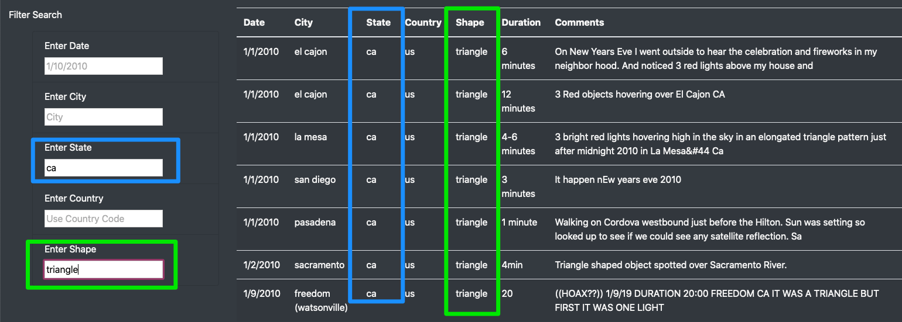

# UFO Sightings
This project aims to collect data on UFO sightings and upload them to a central database for users to easily search via filters based on date, city, state, country and shape. 

## Webpage Walkthrough 
Navigating the single webpage and filtering based on date, city, state, country and shape is a simple process. 
- In the filters section on the left-side of the page, simply type your parameters and the relevant data will show up as seen in the below image: 

## Drawbacks / Recommendations
One major drawback of this page is that the data is very limited -- only covering a two-week period in January 2010. This isn't helpful for people who want a more robust database or to look at trends 
Three ways to improve this site would be to do the follow: 
1. Collect more UFO sightings data to populate the table and deliver more complete information. 
2. Add some additional context such as data from the NASA website or recent news articles about UFOs. 
3. Make the data more consistent (e.g. make the spelling of "minutes" consistent).
